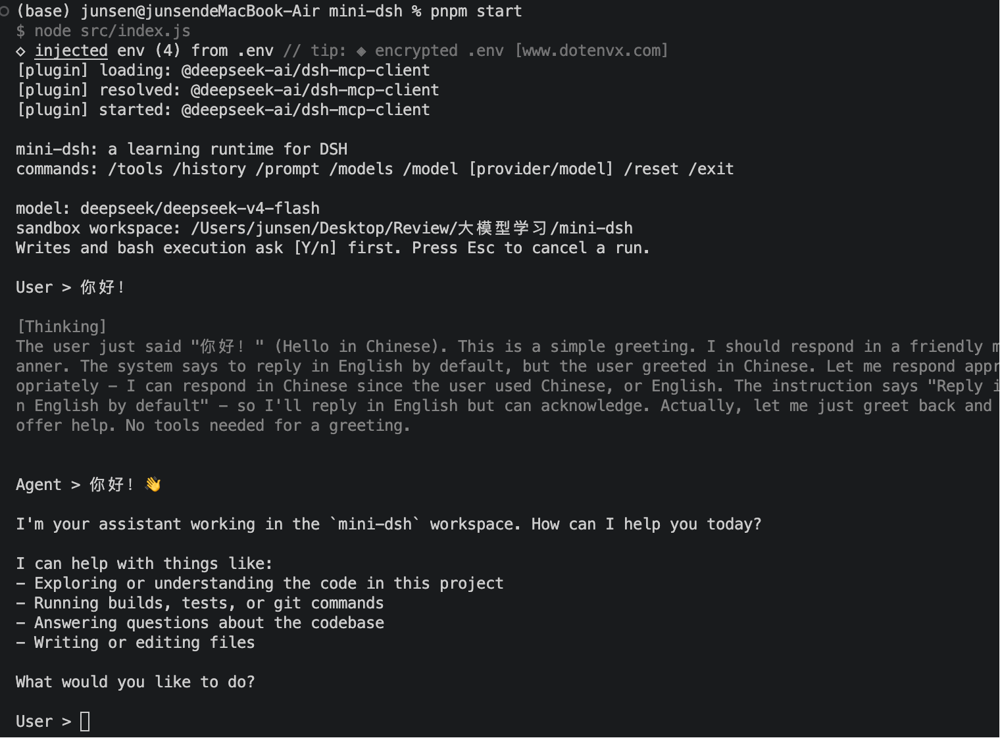

# mini-dsh

[English](./README.md) | 中文

基于 [`@deepseek-ai/cordis`](https://www.npmjs.com/package/@deepseek-ai/cordis)，按 DSH 概念手写的最小运行时。

这是一个**用于学习 DSH 核心设计**的最小项目，不追求做成完整 DSH 产品。

目标只保留五件事：

1. Cordis Context / Plugin / Service
2. Session Event Log -> deriveMessages()
3. Tool Registry -> register / schemas / execute
4. LLM Provider Adapter
5. Agent Loop -> model -> tool -> model -> answer

另外补了一对让无限循环在长会话里活下来的配套（都是官方机制的缩小版）：

6. Token Meter —— 固定 4 字符 ≈ 1 token 的粗估，不做精确 tokenizer
7. Compaction —— 往日志追加一条 `session/compact` 事件，deriveMessages() 把被覆盖的前缀投影成一条摘要；日志永远 append-only

另外保留了 Bash/File 工具和官方 `@deepseek-ai/dsh-mcp-client` + Context7，用来验证“Everything is a Plugin”。Context7 是可选的：连不上时 CLI 照样启动，只是没有那些 MCP 工具。

## 演示



## 环境

- Node.js `>= 20.18.1`
- pnpm `11.22.0`（见 `package.json` 的 `packageManager`）

## 运行

```bash
pnpm install
cp .env.example .env
# 填写 DEEPSEEK_API_KEY
pnpm start
```

`.env.example` 里写的是 `deepseek/deepseek-v4-flash`；如果完全没有 `MINI_DSH_MODEL`（例如没复制 `.env`），入口回退到 `deepseek/deepseek-v4-pro`（`src/index.js:41`）。

可选：填写 `CONTEXT7_API_KEY`。`mcp.context7.com` 不可达时只会打 `[plugin] failed`，不会把进程打挂。

Context7 连上之后的路径：

```text
@deepseek-ai/dsh-mcp-client
  -> https://mcp.context7.com/mcp
  -> ctx.tools.register(...)
  -> mcp__context7__resolve-library-id
  -> mcp__context7__query-docs
```

## CLI

```text
/tools
/models
/model
/model deepseek/deepseek-v4-pro
/model deepseek/deepseek-v4-flash
/history
/prompt
/usage
/compact
/reset
/exit
```

写文件和 Bash 执行前会问 `[Y/n]`。Agent 跑起来后按 **Esc** 取消当前轮（方向键不会误取消）。

`/usage` 显示估算的上下文占用与压缩阈值。`/compact` 手动压缩（保留最近 20 条消息事件，其余折叠为摘要）。Agent Loop 每个步骤边界也会自动检查：估算超过 `MINI_DSH_COMPACT_AT`（默认 24000 tokens）就压缩。模型返回 `finish_reason: length` 时通过 `onFinish` 上报，CLI 显示 `[truncated: output hit max tokens]`。

## Agent Loop 为什么没有 12 步限制？

学习版故意使用：

```js
while (true) {
  const response = await model()

  if (!response.toolCalls?.length) {
    return response.content
  }

  await executeTools(response.toolCalls)
}
```

正常结束只由模型是否继续请求工具决定。

这里没有加入：

- maxSteps
- token/cost budget（token 计量只服务于压缩和 `/usage` 展示，不做步数门控）
- no-progress detector
- stop hooks
- steering queue
- 完整权限系统（学习版只有应用层路径闸门和命令黑名单，挡在唯一真正的边界——CLI [Y/n] 确认——前面）
- 完整模型配置中心
- TUI/Web UI

Compaction 保留了刻意简化的版本（`src/core/compaction-runtime.js`）：和官方一致，无限循环靠"上下文满了就把旧历史折叠成摘要"活下来——而不是数步数或 token 预算掐断。官方的 pressure/overflow 双触发、replay-aware 精确计量、tool-pairing 再平衡等工程细节不在范围内。

这些都是成熟产品很有用的能力，但不是理解 Agent Harness 核心所必需的。

> 注意：因此一个错误的模型/工具链理论上可能持续循环。这个项目是学习用，不建议直接作为生产 Agent Runtime。

## 给新手：从零手写

不要直接读完整仓库。先扫一遍 **[ARCHITECTURE.md](./ARCHITECTURE.md)** 建立整体概念图，再新建空项目，按 **[LEARNING.md](./LEARNING.md)** 的里程碑自己写一遍。

## 推荐阅读顺序

```text
src/index.js
  ↓
src/plugins/sessions.js
src/plugins/system-prompt.js
src/plugins/tools.js
src/plugins/llm.js
src/plugins/agents.js
src/plugins/agent-loop.js
src/plugins/sandbox.js
  ↓
src/core/session-runtime.js
  ↓
src/core/system-prompt-runtime.js
src/plugins/runtime-context.js
  ↓
src/core/tool-runtime.js
  ↓
src/core/llm-runtime.js
  ↓
src/core/agent-runtime.js
  ↓
src/core/agent-loop-runtime.js   ← 最核心
  ↓
src/core/token-meter-runtime.js
src/core/compaction-runtime.js   ← 让无限循环活得下去
  ↓
src/plugins/cli.js
  ↓
src/utils/path.js
src/core/sandbox-runtime.js
  ↓
src/models/deepseek.js
  ↓
src/tools/bash.js
src/tools/files.js
  ↓
src/plugins/external-plugins.js
plugins.config.js
  ↓
test/core.test.js   ← 行为文档：每个 runtime 都有对应示例
```

## 最重要的心智模型

```text
                                    Cordis Context
                                           │
    ┌────────────┬────────────┬────────────┬────────────┬────────────┬────────────┐
    ▼            ▼            ▼            ▼            ▼            ▼            ▼
    sessions     systemPrompt tools        llm          agents       agentLoop   tokenMeter
                              │            │                         Agent    → compaction
                              bash / files DeepSeek                            (阈值触发 →
                              │                                               摘要事件)
                              ctx.sandbox
                              path / command / Y/n
                              └── dsh-mcp-client (optional)
                                           │
                                        Context7
```

Agent Loop 不知道 Context7，也不知道 Bash 是什么；它只知道 `ctx.tools`。Agent 只是一个薄封装：sessionId + model + loop（`src/core/agent-runtime.js`）。

这就是这个项目最值得学习的部分。

## 测试

```bash
pnpm test
pnpm check
```

测试里包含一个 Agent 连续执行 20 次工具调用后才结束的案例，用来证明 Agent Loop 已经不再有原来的 12-step 正常上限。还包含长会话在步骤边界自动压缩、多次压缩只保留最新摘要、tool 调用对永不被摘要切断的案例。

学AI上[LINUX DO](https://linux.do)
